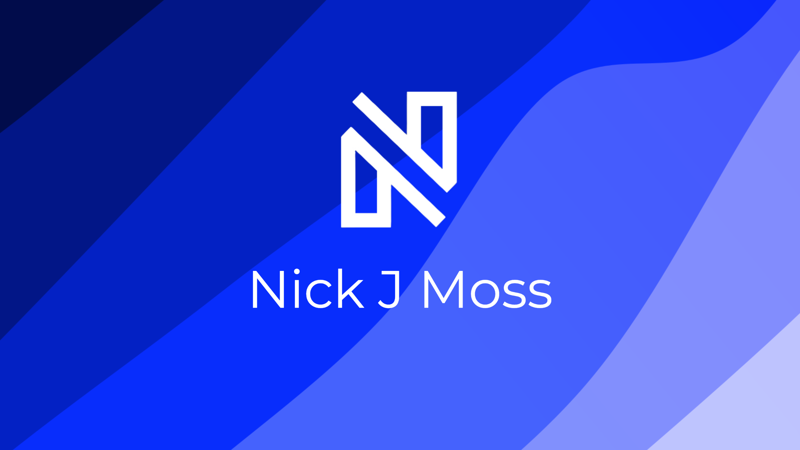
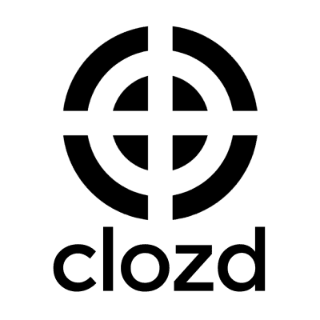

# 
# Hello!👋

My name is Nick! I am currently a Software Engineer at Clozd Inc., which specializes in win-loss analysis. I am on my way to receiving my BS in Computer Science at Utah Valley University with a concentration in Full-Stack Development. I love programming and I am learning new things daily to improve my skills in software engineering and full-stack development. Take a look at the rest of my profile to learn more about me, you can also check me out on other platforms just look at my <a href="#contact-me">Contact Me</a> section.

---

## My Skills

### Proficient:
     

### Advanced:
  

### Intermediate:
 

---

## My Experience

### Software Engineer

*Jan 2022-Present*

&nbsp;  
&nbsp;  

### Data Quality Intern

*March 2021-Jan 2022*

- Using PostgreSQL every day, maintained the quality of millions of genealogical records through a relational database.
- Reported and resolved over 60 data quality issues to date using project management software such as JIRA.
- Completed internal company training courses for JavaScript and React.js that consisted of videos, exercises and company sponsored workshops.
- Developed several PL/pgsql functions to assist in the quality assurance of hundreds of genealogical record batches.

&nbsp;  
&nbsp;  

### Student Services Representative

*May 2020-March 2021*

- Managed the technical onboarding process of all employees through the setup of
tools such as computers, email accounts through G Suite, business applications, and
signature lines.
- Took strong initiative to implement technological strategies that allowed for faster,
more efficient communication with all company personnel and clients.
- Managed the content of the company website through WordPress which lead to an
increase of company productivity and success demonstrated by the opening of 8 new
school locations since starting with the company.
- Acted in a business development role contracting 7 new clinics to the school through
personal visits, phone calls, and email communication.
- Provided excellent service to all potential students looking to sign up for phlebotomy
classes via the company website or over the phone by providing up to date
information and using sales tactics.
&nbsp;  
&nbsp;  

---

## My Projects

## Nick's GitHub Stats

---

## Contact Me

## Support Me

